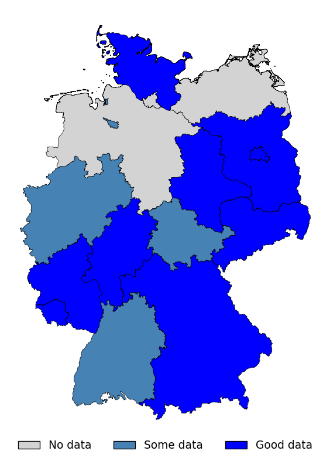
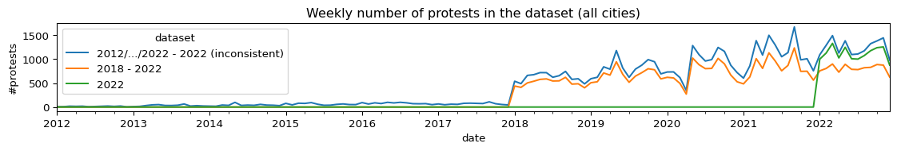

# The German Protest Registrations Dataset

The __German Protest Registrations Dataset__ covers protests that have been registered with demonstration authorities in 16 German cities. The data has been compiled from _Freedom of Information_ requests and covers dates, organizers, topics, the number of registered participants, and for some cities the number of observed participants. Covered date ranges vary, with all cities covered in 2022, and 5 cities covered consistently from 2018 to 2022. In comparison to previous datasets that are largely based on newspaper reports, this dataset gives an unprecented level of detail, and is the largest dataset on protest events in Germany to date. This report gives an overview over existing datasets, explains the data retrieval and processing, displays the properties of the dataset, and discusses its limitations. Code and data are available [on Github](https://github.com/davidpomerenke/german-protest-registrations).

- [Introduction](#introduction)
- [Related work](#related-work)
- [Methods](#methods)
- [Results](#results)
- [Discussion and Limitations](#discussion-and-limitations)
- [Conclusion](#conclusion)
- [Contact](#contact)
- [References](#references)

## Introduction

This dataset leverages *Freedom of Information* laws to collect official
protest data from 17 different cities in Germany.

**Demonstration authorities.** The organizers of demonstrations are
legally required in Germany (as well as in many other countries) to
notify so-called *demonstration authorities* before the demonstration
takes place (Art. 8 Abs. 2 GG, § 14 VersammlG). Demonstration
authorities (*Versammlungsbehörden*) in Germany are either part of the
police or of the municipal administrations, depending on the region. The
authorities keep records of all registered demonstrations. Some protests
are not registered in advance, especially more disruptive and illegal
protest forms, and they are therefore not contained in these records.

**Freedom of information laws.** Official documents, including protest
records, can be obtained via *Freedom of Information* laws. These [exist
in more than 100
countries](https://en.wikipedia.org/wiki/Freedom_of_information_laws_by_country)
and allow anyone to obtain public documents. The specific requirements,
exceptions, and costs vary greatly. In Germany, freedom of information
exists on the federal level; but many authorities belong to the regional
level, where the extent of freedom of information rights [varies
greatly](https://transparenzranking.de/); and municipal authorities are
not always covered by regional freedom of information laws, sometimes
filling the gap with their own legislation.

**Freedom of information platforms.** Access to public documents has
been democratized via platforms that streamline the process of sending
requests, escalating the process to oversight authorities or courts if
necessary, and making communication and obtained documents available to
the public. The [Alaveteli](http://alaveteli.org/) network provides
software and hosts such platforms in more than 30 countries across the
world. Some independent platforms also exist, such as
[Öffentlichkeitsgestz.ch](https://www.oeffentlichkeitsgesetz.ch/) in
Switzerland, and *FragDenStaat* [in Austria](https://fragdenstaat.at/)
and [in Germany](https://fragdenstaat.de/). These open the possibility
of obtaining official protest data at scale.

## Related work

Multiple approaches have already been used for the creation of datasets
on protests in Germany. gives an overview about the existing and new
datasets.

**Event databases** provide disaggregated event data, often on a global
scale and with constant updates. The database of choice for protest
research is the [*Armed Conflict Location and Event
Dataset*](https://acleddata.com/) \[ACLED; Raleigh et al. (2010)\].
ACLED is a grand effort that keeps track not only of violent conflicts
and riots, but also of ordinary protest events. The data is
human-curated based on newspaper reports, and contains coded information
on dates, locations, actor groups, police interventions, and more, as
well as a short free-text summary for each event, containing an estimate
of the size as per the newspaper data source. Data for Germany is
available starting from 2020 and is continuously updated. Another
relevant event database is the [Global Database of Events, Language, and
Tone](https://www.gdeltproject.org/) \[GDELT; Leetaru and Schrodt
(n.d.)\]. It relies completely on the automated processing of newspaper
articles, and does not have protest-specific information such as
organizers, topics, or number of participants.

**Academic datasets** have been created through the manual coding of
newspaper articles and other sources. [Protestlandschaft
Deutschland](https://protestdata.eu/methods) provides interactive
visualizations for three German datasets:

1.  [ProDat](https://www.wzb.eu/de/forschung/beendete-forschungsprogramme/zivilgesellschaft-und-politische-mobilisierung/projekte/prodat-dokumentation-und-analyse-von-protestereignissen-in-der-bundesrepublik)
    (Rucht, Hocke, and Ohlemacher 1992) has coded all newspaper articles
    on Mondays – as well as all days of every 4th week – from 1950 to
    2002 in *Süddeutsche Zeitung* and *Frankfurter Rundschau*.
2.  [“Lokale Protestentwicklungen
    Großstädte”](https://www.fgz-risc.de/forschung/alle-forschungsprojekte/details/BRE_F_04)
    has coded all articles in *Sächsische Zeitung* (Dresden), *Leipziger
    Volkszeitung*, *Stuttgarter Zeitung*, and *Weser-Kurier* (Bremen)
    from 2011 to 2020.
3.  [“Lokale Protestentwicklungen
    Mittelstädte”](https://www.dezim-institut.de/projekte/projekt-detail/lokale-konflikte-um-migration-2-15/)
    has coded all articles in 12 medium-sized German cities.

Protest events in Germany are also part of international protest
datasets: [PolDem](https://poldem.eui.eu/) (Kriesi et al. 2020) provides
3 datasets with different countries and time ranges covered, based on
newspaper articles obtained from *NexisLexis*. And the [Mass
Mobilization
Project](https://dataverse.harvard.edu/dataset.xhtml?persistentId=doi:10.7910/DVN/HTTWYL)
(Clark and Regan 2022) records and codes protest events globally from
2014 to 2019.

**Official records** have been explored only on a small scale: Kanol and
Knoesel (2021) compiles government responses to opposition requests
about right-wing extremist demonstrations in Germany, starting in 2005.
And [Demo-Hauptstadt
Berlin](https://fragdenstaat.de/dossier/demo‐hauptstadt‐berlin/) has
used *Freedom of Information* requests to obtain data on all
demonstrations in Berlin from 2018 to 2022.

| **Dataset**                       | **Source**    | **Start**   | **End** | **Topics?** | **Reg?** | **Obs?** | **\#Cities** | **\#Events** |
| --------------------------------- | ------------- | ----------- | ------- | ----------- | -------- | -------- | ------------ | ------------ |
| ACLED                             | newspapers, … | 2020        | ongoing | ✓           |          | ✓        | all          | 13,250       |
| ProDat                            | newspapers    | 1950        | 2002    | ✓           |          | ✓        | all          | 15,973       |
| Lokale Protestentw. Großstädte    | newspapers    | 2011        | 2020    | (✓)         |          | ✓        | 4            | 4,708        |
| Lokale Protestentw. Mittelstädte  | newspapers    | 2014        | 2018    | (✓)         |          | ✓        | 12           | 1,988        |
| PolDem 30                         | newspapers    | 2000        | 2015    | (✓)         |          | ✓        | all          | 2,252        |
| PolDem 6                          | newspapers    | 1975        | 2011    | ✓           |          | ✓        | all          | 8,887        |
| PolDem EU                         | newspapers    | 1995        | 2009    | ✓           |          | ✓        | all          | 56           |
| Mass Mobilization Project         | newspapers    | 1990        | 2014    | ✓           |          | ✓        | all          | 364          |
| Right-Wing Extremist Mobilization | government    | 2005        | 2020    | ✓           |          | ✓        | all          | 3,290        |
| Demo-Hauptstadt Berlin            | dem. auth.    | 2018        | 2020    | ✓           | ✓        | ✓        | 1            | 12,775       |
| German Protest Reg. 2022          | dem. auth.    | 2022        | 2022    | ✓           | ✓        | (✓)      | 13           | 12,581       |
| German Protest Reg. 2018-2022     | dem. auth.    | 2018        | 2022    | ✓           | ✓        | (✓)      | 5            | 39,740       |
| German Protest Reg. (all)         | dem. auth.    | 2012/…/2022 | 2022    | ✓           | (✓)      | (✓)      | 16           | 57,010       |

<!-- Lokale Konfliktdynamiken im Vergleich: Bremen 1178, Dresden 1147, Leipzig 1274, Stuttgart 1109
Lokale Konflikte um Migration: Celle 200, Düren 125, Esslingen 188, Herten 96, Husum 82, Neubrandenburg 219, Neuruppin 155, Offenburg 211, Plauen 376, Rendsburg 90, Weilheim 118, Wismar 128 -->

## Methods

**Retrieval.** I send freedom of information requests to German
demonstration authorities (depending on the region these are either part
of the municipal administrations or of the police) and their supervisory
bodies concerning protest data in 32 cities. These cities comprise the
political capitals of all 16 regions in Germany, the 17 largest cities
by population size, as well as some smaller cities for regions where the
request in the regional capital is unsuccessful. 4 requests are not
answered, 2 are rejected, 5 state that they do not possess such data, 2
have to be withdrawn due to demanded payments of multiple hundreds of
euros, and 19 are partially or completely successful.[^1] The requests
and responses including the original data files can be found at
[FragDenStaat](https://fragdenstaat.de/anfragen/?q=demonstration+csv&first_after=2022-12-01&first_before=2023-07-31).

**Processing.** I convert all files to CSV using the *pandas* library
(team 2020), *Adobe PDF Converter*, and *PdfTables.com*. Since the
column names and formats vary widely, I create a separate table reader
script for each city. For the challenge of I use the
[*dateparser*](https://github.com/scrapinghub/dateparser) library
(parsing about 90% of dates), hand-written regex rules based on the most
common patterns in the data (parsing about 9% of the data), and manual
coding for the remaining data points. Multi-day events are reduced to
their start date. When a single data point describes multiple events, it
is reduced to the first day of the first event. Data points without date
information are dropped. Participant numbers are also parsed using a
combination of regex rules and manual coding; specifiers such as “max.”,
“min.”, “bis zu” are ignored, and for number ranges the rounded average
is applied. The dataset for Augsburg cannot be converted from PDF to
CSV, the dataset for Mannheim is poorly structured, and the dataset for
Dortmund does not have topic information, so I exclude them.

## Results

The resulting dataset contains 57.010 events from 16 cities. For 13
cities the ex-ante number of expected participants are given, and for 2
of them (Berlin and Magdeburg) the ex-post extimates by the police are
also included. For all cities the topic of the protest is given, as
specified by the organizers themselves; and for 4 cities (Erfurt,
München, Wiesbaden, Wuppertal) the name of the organizing group is also
known.

| region              | city        | kpop   | cap? | reg? | obs? | 12   | 13   | 14   | 15   | 16   | 17   | 18    | 19    | 20     | 21     | 22     |
| :------------------ | :---------- | :----- | :--- | :--- | :--- | :--- | :--- | :--- | :--- | :--- | :--- | :---- | :---- | :----- | :----- | :----- |
| Baden-Württemberg   | Freiburg    | 236    |      |      |      |      | 164  | 167  | 209  | 199  | 199  | 247   | 339   | 521    | 596    | 524    |
| Baden-Württemberg   | Karlsruhe   | 308    |      | x    |      |      |      |      |      |      |      |       |       |        | 490    | 464    |
| Bayern              | München     | 1,512  | x    | x    |      |      |      |      |      |      |      | 1,153 | 1,169 | 1,366  | 1,984  | 1,169  |
| Berlin              | Berlin      | 3,755  | x    | x    | x    |      |      |      |      |      |      | 4,340 | 5,481 | 5,582  | 6,220  | 6,455  |
| Brandenburg         | Potsdam     | 185    | x    | x    |      |      |      |      |      |      |      |       | 215   | 241    | 287    | 321    |
| Bremen              | Bremen      | 569    | x    |      |      |      |      |      |      |      |      |       | 656   | 634    | 624    | 727    |
| Hamburg             | –           | –      |      |      |      |      |      |      |      |      |      |       |       |        |        |        |
| Hessen              | Wiesbaden   | 283    | x    | x    |      |      |      |      |      |      |      |       | 158   | 233    | 304    | 257    |
| Meck.-Vorpommern    | –           | –      |      |      |      |      |      |      |      |      |      |       |       |        |        |        |
| Niedersachsen       | –           | –      |      |      |      |      |      |      |      |      |      |       |       |        |        |        |
| Nordrhein-Westfalen | Dortmund    | 593    |      | x    |      |      |      |      |      |      |      |       | 668   | 686    | 612    | 784    |
| Nordrhein-Westfalen | Duisburg    | 502    |      | x    |      |      |      |      |      | 385  | 282  | 218   | 306   | 379    | 408    | 437    |
| Nordrhein-Westfalen | Köln        | 1,084  |      | x    |      |      |      |      |      |      |      | 872   |       |        |        | 1,240  |
| Nordrhein-Westfalen | Wuppertal   | 358    |      | x    |      |      |      |      |      |      |      |       |       |        |        | 207    |
| Rheinland-Pfalz     | Mainz       | 220    | x    | x    |      |      |      |      |      |      |      | 255   | 249   | 303    | 312    | 412    |
| Saarland            | Saarbrücken | 181    | x    | x    |      |      |      |      |      |      |      |       |       |        | 197    | 436    |
| Sachsen             | Dresden     | 563    | x    | x    |      |      |      |      |      |      |      |       |       | 162    | 293    | 406    |
| Sachsen-Anhalt      | Magdeburg   | 239    | x    | x    | x    |      |      |      | 216  | 165  | 134  | 172   | 221   | 309    | 406    | 434    |
| Schleswig-Holstein  | Kiel        | 247    | x    | x    |      |      |      |      |      |      |      |       |       |        | 259    | 343    |
| Thüringen           | Erfurt      | 214    | x    |      |      | 163  | 227  | 319  | 305  | 199  | 198  | 220   | 297   | 342    | 350    | 277    |
|                     | sum         | 11,057 | 11   | 14   | 2    | 163  | 391  | 486  | 730  | 948  | 813  | 7,477 | 9,759 | 10,758 | 13,342 | 14,893 |

Table 1: Overview of the German Protest Registrations dataset. *kpop* =
population in 1000; *cap?* = whether the city is the political capital
of its region; *reg?* = whether the number of registered protesters (as
per the organizers) is available; *obs?* = whether the number of
observed protesters (as per the police) is available; *12 … 22* = number
of records per city from 2012 to 2022.

Further statistics about the dataset can be seen in table
[Table 1](#tbl-overview). [Figure 1](#fig-map) shows the regional
coverage of the dataset.

As apparent from [Table 1](#tbl-overview), the covered years vary
between cities. Using the whole dataset unfiltered would therefore lead
to inconsistencies in developments over time. Therefore the dataset is
provided in three subsets (see also the bottom of ):

1.  The **2018-2022 dataset** contains only cities that have coverage
    throughout 2018-2022, and that also have the number of registered
    participants available. This results in a large dataset (about
    40.000 entries) that strikes a balance between regional diversity (5
    cities) and time coverage (4 years).
2.  The **2022 dataset** contains all cities that have data available in
    2022, and also have the number of registered participants available.
    With 13 cities covered but only 12.500 overall entries, it is useful
    especially for the study of geographic variations.
3.  The **unfiltered dataset** contains all data without restrictions on
    included cities and time ranges, overall 57.000 entries. It also
    contains cities where the number of registered participants is not
    available. This dataset should *not* be used for direct analysis;
    but it may be used for the creation of alternative consistent
    sub-datasets similar to the two ones above.

## Discussion and Limitations

The main **benefits** of authority data are:

1.  **Level of detail:** Many more events (per timeframe, and overall)
    are included than in any existing dataset based on newspaper
    analyses.
2.  Avoidance of **selection bias** of the media. This is feared to be
    an immense problem associated with newspaper-based data (Hutter
    2014; James Ozden and Sam Glover 2022). This dataset may also help
    examining the actual amount of media selection bias.

The two main **downsides** of using data from demonstration authorities
are:

1.  **Unreliability:** Since the data is only about registrations, we do
    not know whether the events have actually taken place, and how many
    people have actually participated. (Only for some cities – Berlin
    and Magdeburg – we can know it via the numbers of observerd
    participants, and for other cities – München – via indications of
    cancelled events.)
2.  **Incompleteness:**
    - Not all protests are registered. Some disruptive groups such as
      *Letzte Generation* deliberately do *not* register many of their
      protest actions.
    - Only a handful of municipalities are included, focusing on large
      and politically relevant cities and ignoring the places of
      residence of more than 85% of the population.

**Criticisms of authority data.** Protest research has identified two
main sources of protest event data – newspaper data and data from
authorities – and overwhelmingly relies on the first source, that is
newspaper data. Objections are raised against the use of data from
demonstration authorities, as being biased, uninformative about the
motives and organizers, uncomparable across regions, often unavailable
or unobtainable, and because it is restricted to only registered
demonstrations Wiedemann et al. (2022).

I agree with these objections only in part:

- With *Freedom of Information* laws and platforms such as
  *FragDenStaat* it is now possible to obtain this data easily, cheaply,
  and at scale – however with the exception of regions with weak
  *Freedom of Information* laws or poor data management (see
  [Figure 1](#fig-map)).
- In 17 out of 19 cities the data contains information about the topics
  of the demonstrations, as specified by the organizers; this may well
  give a better perspective on the organizers and their motives than
  subsequent newspaper coverage may give.
- The data from demonstration authorities avoids both media bias in
  judging the goals of the organizers, as well as media bias in the
  selection of events worth reporting, and is thus arguably *less*
  biased than media-derived data. Only the numbers of participants are
  judged by the police and may be subject to bias, just as the estimates
  by journalists may also be subject to bias; researchers will be aware
  of topics where this may be especially problematic, such as
  anti-police protests.
- Regarding the issue of comparability, the current datasets are
  specifially designed to be comparable across regions, by focusing on
  key information that exists in all regions in similar formats.

<!-- __Causal inference for protest impact evaluation.__ The dataset is not suitable for one widespread method, that is, _instrumental variables_ using weather data. Rather, it is especially suited to _synthetic control_ analyses. -->

## Conclusion

The *German Protest Registrations* dataset presents opportunities for
more detailed and less biased protest event analysis. Researchers should
be aware of reliability problems with this type of data, and of the
exclusion of non-registered protests. While the unfiltered dataset comes
with inconsistent data over time, two consistent subsets are provided
and researchers are encouraged to create their own consistent subsets.
The dataset may drive insights internal to protest research – such as
the relation between registration and observation data –, as well as to
applications such as protest impact evaluation.

## Contact

Please contact me via email to <firstnamelastname@mailbox.org>, or using
the discussion and issue features [on
Github](https://github.com/davidpomerenke/german-protest-registrations).

## References

Clark, David, and Patrick Regan. 2022. “Mass Mobilization Protest Data.”
Harvard Dataverse. <https://doi.org/10.7910/DVN/HTTWYL>.

Hutter, Swen. 2014. “Protest Event Analysis and Its Offspring.” In
*Methodological Practices in Social Movement Research*, edited by
Donatella della Porta, 335–67. Oxford University Press.
<https://doi.org/10.1093/acprof:oso/9780198719571.003.0014>.

James Ozden, and Sam Glover. 2022. “Literature Review: Protest
Outcomes.” Social Change Lab.
<https://www.socialchangelab.org/_files/ugd/503ba4_21103ca09bf247748a788c92c60371a0.pdf>.

Kanol, Eylem, and Johanna Knoesel. 2021. “Right-Wing Extremist
Mobilization in Germany.” Wissenschaftszentrum Berlin für
Sozialforschung. <https://doi.org/10.7802/2256>.

Kriesi, Hanspeter, Bruno Wüest, Jasmine Lorenzini, Peter Makarov,
Matthias Enggist, Klaus Rothenhäusler, Thomas Kurer, et al. 2020.
“Poldem - Protest Dataset 30 European Countries.”

Leetaru, Kalev, and Philip A Schrodt. n.d. “GDELT: Global Data on
Events, Location and Tone.”

“Protestlandschaft Deutschland.” n.d. Accessed April 5, 2023.
<https://protestdata.eu/>.

Raleigh, Clionadh, rew Linke, Håvard Hegre, and Joakim Karlsen. 2010.
“Introducing ACLED: An Armed Conflict Location and Event Dataset.”
*Journal of Peace Research* 47 (5): 651–60.
<https://doi.org/10.1177/0022343310378914>.

Rucht, Dieter, Peter Hocke, and Thomas Ohlemacher. 1992. “Dokumentation
Und Analyse von Protestereignissen in Der Bundesrepublik Deutschland
(Prodat). Codebuch.” Wissenschaftszentrum Berlin Berlin.

team, The pandas development. 2020. “Pandas-Dev/Pandas: Pandas.” Zenodo.
<https://doi.org/10.5281/zenodo.3509134>.

Wiedemann, Gregor, Jan Matti Dollbaum, Sebastian Haunss, Priska Daphi,
and Larissa Daria Meier. 2022. “A Generalized Approach to Protest Event
Detection in German Local News.” In *Proceedings of the Thirteenth
Language Resources and Evaluation Conference*, 3883–91. Marseille,
France: European Language Resources Association.
<https://aclanthology.org/2022.lrec-1.413>.

[^1]: Not answered: Bochum, Essen, Düsseldorf, Chemnitz. Rejected:
    Hannover, Frankfurt am Main. No information available: Hamburg,
    Leipzig, Nürnberg, Schwerin, Rostock. Redrawn due to high costs:
    Stuttgart, Halle (Saale).
